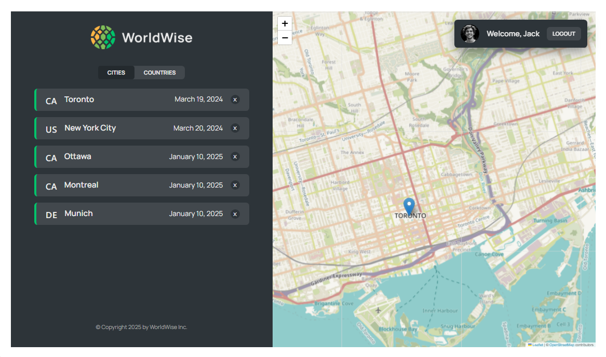

## 👋 Introduction

A dynamic web application that enables users to explore cities around the globe. With an intuitive map interface, users can track and save their favorite city entries, discover new destinations, and curate personalized traveled cities lists.



## 🌟 Features

- **Map Geolocation** : Users can choose their preferred cities by simply clicking on the map locations.
- **Cities List** : Users can review and remove cities they have saved.
- **Countries List** : Users can access a list of countries corresponding to the cities they have saved.
- **Map View** : Users can view the cities they have saved on the map.

## 👨‍💻 Technologies

- **[React](https://react.dev/)** : JavaScript library for UI development.
- **[Vite](https://vite.dev/)** : A blazing fast frontend build tool
- **[JSONBIN](https://jsonbin.io/)** : REST interface to store & retrieve JSON data from the cloud
- **[Leaflet](https://leafletjs.com/)** : A JavaScript library for interactive maps
- **[React Leaflet](https://react-leaflet.js.org/)** : React components for Leaflet maps
- **[ESLint](https://eslint.org/)** : Find and fix problems with JavaScript code

## 🎗️ Instalation Steps

```
git clone https://github.com/pfiterman/webAppWorldWise.git
```

2. Install the required dependencies:

```
npm install
```

3. Run the developtment Server

```
npm run dev
```

4. Access the application

```
http://localhost:5173
```

## 🔒 Credentials for Login in

You can access our application using the following fake user account:

- User: jack@example.com
- Password: qwerty!@#%

## 💰 Support me by Donating

[](https://buymeacoffee.com/pfiterman)
